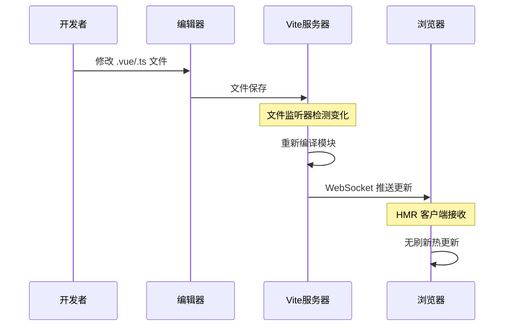

# 前后端联调开发指南

## 📋 概述

本文档提供 WeChat RSS 项目前后端联调的完整指南，包括服务架构、启动流程、热重载机制和开发最佳实践。

## 🏗️ 服务架构

### 完整架构图

```
┌─────────────────────────────────────────────────────────────────┐
│                    开发环境架构                                  │
├─────────────────────────────────────────────────────────────────┤
│  🔥 前端热重载服务 (端口 3001/3000)                             │
│     ├── Vite 开发服务器 (独立运行)                             │
│     ├── 文件监听 + 热重载 (不依赖后端)                         │
│     ├── Vue 组件实时更新                                       │
│     └── CSS 样式实时更新                                       │
├─────────────────────────────────────────────────────────────────┤
│  📡 API 代理层 (vite.config.ts)                               │
│     ├── /api/* → http://localhost:8001                        │
│     ├── /static/* → http://localhost:8001                     │
│     ├── /files/* → http://localhost:8001                      │
│     └── 跨域处理 & 请求转发                                   │
├─────────────────────────────────────────────────────────────────┤
│  🐍 后端服务 (端口 8001)                                       │
│     ├── Python FastAPI 应用                                    │
│     ├── 数据库操作 (SQLite)                                   │
│     ├── 业务逻辑处理                                           │
│     ├── 静态文件服务 (/static)                                │
│     └── 生产环境页面服务                                       │
└─────────────────────────────────────────────────────────────────┘
```

### 两种访问方式

| 访问方式 | 地址 | 服务类型 | 特点 | 适用场景 |
|---------|------|----------|------|----------|
| **开发环境** | `http://localhost:3001` | Vite 开发服务器 | ✅ 热重载<br/>✅ 源码调试<br/>✅ 完整功能 | 日常开发、调试 |
| **生产环境** | `http://localhost:8001` | FastAPI 静态文件 | ✅ 生产版本<br/>✅ 性能优化<br/>❌ 无热重载 | 功能验证、部署测试 |

## 🚀 服务启动

### 启动顺序 (推荐)

#### 1. 启动后端服务

```bash
# 进入项目根目录
cd D:\we_mp_rss\we-mp-rss

# 启动后端服务 (包含初始化和定时任务)
python main.py -job True -init True
```

**启动成功标志**:
```
启动服务器
INFO:     Uvicorn running on http://0.0.0.0:8001 (Press CTRL+C to quit)
INFO:     Started parent process [进程ID]
```

#### 2. 启动前端开发服务

```bash
# 进入前端目录
cd D:\we_mp_rss\we-mp-rss\web_ui

# 启动前端开发服务器
npm run dev
```

**启动成功标志**:
```
vite v2.9.18 dev server running at:
> Local:    http://localhost:3000/
ready in XXXms.
```

### 服务状态检查

```bash
# 检查端口占用情况
netstat -an | findstr "3001\|8001"

# 应该看到两个端口都在监听状态
# TCP    0.0.0.0:3001    0.0.0.0:0    LISTENING
# TCP    0.0.0.0:8001    0.0.0.0:0    LISTENING
```

## 🔥 热重载机制详解

### 工作原理



### 热重载类型

| 更新类型 | 控制台输出 | 说明 |
|---------|------------|------|
| **Vue组件** | `[vite] hmr update /src/App.vue` | 组件逻辑更新，保持状态 |
| **CSS样式** | `hmr update /src/App.vue?vue&type=style` | 样式实时更新 |
| **配置文件** | `vite.config.ts changed, restarting server` | 重启开发服务器 |
| **入口文件** | `[vite] page reload src/main.ts` | 完整页面刷新 |

### WebSocket 连接

热重载通过 WebSocket 实现实时通信：
- **连接建立**: 浏览器控制台显示 `[vite] connected.`
- **实时推送**: 文件变化时立即推送更新
- **状态保持**: 组件状态在更新后保持不变

## 🔧 开发工作流

### 典型开发流程

1. **启动服务**: 后端 → 前端 (推荐顺序)
2. **访问应用**: 浏览器打开 `http://localhost:3001`
3. **编写代码**: 修改 Vue 组件、样式或逻辑
4. **实时查看**: 保存后浏览器自动更新
5. **API调试**: 利用浏览器开发者工具调试请求
6. **功能测试**: 测试完整的前后端交互

### API 代理配置

前端请求自动代理到后端，配置在 `vite.config.ts`：

```typescript
server: {
  host: "0.0.0.0",
  port: 3000,
  proxy: {
    "/api": {
      target: env.VITE_API_BASE_URL,  // http://localhost:8001
      changeOrigin: true
    },
    "/static": {
      target: env.VITE_API_BASE_URL,
      changeOrigin: true
    },
    "/files": {
      target: env.VITE_API_BASE_URL,
      changeOrigin: true
    }
  }
}
```

## ⏹️ 服务关闭

### 关闭前端服务

**在前端终端中**:
```bash
# 按 Ctrl+C 停止 Vite 开发服务器
^C
```

**或者强制关闭**:
```bash
# 查找进程
netstat -ano | findstr :3001

# 强制结束进程 (替换 PID 为实际进程ID)
taskkill /PID 进程ID /F
```

### 关闭后端服务

**在后端终端中**:
```bash
# 按 Ctrl+C 停止 Python 服务
^C
```

**或者强制关闭**:
```bash
# 查找进程
netstat -ano | findstr :8001

# 强制结束进程 (替换 PID 为实际进程ID)
taskkill /PID 进程ID /F
```

### 批量关闭脚本

创建 `stop_services.bat` 文件：

```batch
@echo off
echo 正在关闭前后端服务...

echo 关闭前端服务 (端口 3000/3001)...
for /f "tokens=5" %%a in ('netstat -ano ^| findstr :3000') do taskkill /PID %%a /F 2>nul
for /f "tokens=5" %%a in ('netstat -ano ^| findstr :3001') do taskkill /PID %%a /F 2>nul

echo 关闭后端服务 (端口 8001)...
for /f "tokens=5" %%a in ('netstat -ano ^| findstr :8001') do taskkill /PID %%a /F 2>nul

echo 所有服务已关闭完成！
pause
```

## 🔄 下次启动指南

### 快速启动脚本

创建 `start_dev.bat` 文件：

```batch
@echo off
echo 启动前后端联调环境...

echo 1. 启动后端服务...
cd /d "D:\we_mp_rss\we-mp-rss"
start "后端服务" cmd /k "python main.py -job True -init True"

echo 等待后端服务启动 (5秒)...
timeout /t 5 /nobreak >nul

echo 2. 启动前端服务...
cd /d "D:\we_mp_rss\we-mp-rss\web_ui"
start "前端服务" cmd /k "npm run dev"

echo 3. 打开浏览器...
timeout /t 3 /nobreak >nul
start http://localhost:3001

echo 联调环境启动完成！
echo 前端开发: http://localhost:3001
echo 后端API: http://localhost:8001
pause
```

### 手动启动步骤

#### 第一步: 启动后端

```bash
# 打开第一个终端窗口
cd D:\we_mp_rss\we-mp-rss
python main.py -job True -init True

# 等待看到: "INFO: Uvicorn running on http://0.0.0.0:8001"
```

#### 第二步: 启动前端

```bash
# 打开第二个终端窗口
cd D:\we_mp_rss\we-mp-rss\web_ui
npm run dev

# 等待看到: "ready in XXXms."
```

#### 第三步: 开始开发

- 访问 `http://localhost:3001` 进行开发
- 修改代码享受热重载
- 使用浏览器开发者工具调试

## 🛠️ 故障排除

### 常见问题

#### 1. 端口冲突
**症状**: `Port 3000 is in use, trying another one...`

**解决方案**:
```bash
# 查找占用进程
netstat -ano | findstr :3000

# 结束进程
taskkill /PID 进程ID /F

# 或使用其他端口
npm run dev -- --port 3002
```

#### 2. API 请求失败
**症状**: 前端显示网络错误或 500 错误

**检查步骤**:
1. 确认后端服务正在运行 (`http://localhost:8001`)
2. 检查 `vite.config.ts` 中的代理配置
3. 查看浏览器 Network 面板的请求详情
4. 检查后端终端的错误日志

#### 3. 热重载失效
**症状**: 修改代码后页面不更新

**解决方案**:
1. 检查浏览器控制台是否显示 `[vite] connected.`
2. 重启前端开发服务器
3. 清除浏览器缓存
4. 检查文件保存是否成功

#### 4. 依赖问题
**症状**: 启动时报错或模块找不到

**解决方案**:
```bash
# 清理并重新安装依赖
cd D:\we_mp_rss\we-mp-rss\web_ui
npm cache clean --force
rm -rf node_modules package-lock.json
npm install
```

### 调试技巧

#### 前端调试
- **Vue DevTools**: 安装浏览器插件查看组件状态
- **断点调试**: 在 IntelliJ IDEA 中设置断点
- **控制台**: 使用 `console.log()` 调试
- **Network**: 查看 API 请求和响应

#### 后端调试
- **日志输出**: 查看终端中的 API 请求日志
- **数据库**: 检查 `data/db.db` 数据变化
- **API文档**: 访问 `http://localhost:8001/api/docs`

## 📝 最佳实践

### 开发规范

1. **启动顺序**: 始终先启动后端，再启动前端
2. **代码保存**: 使用自动保存功能，享受实时更新
3. **浏览器选择**: 推荐使用 Chrome 获得最佳开发体验
4. **终端管理**: 为前后端服务使用独立的终端窗口
5. **错误处理**: 及时查看控制台错误信息

### 性能优化

1. **热重载范围**: 只修改正在开发的组件相关文件
2. **依赖管理**: 定期清理不必要的 npm 包
3. **缓存清理**: 遇到问题时首先尝试清除缓存
4. **代码拆分**: 将大组件拆分为小组件提高热重载效率

## 🎯 总结

### 核心要点

- **热重载独立运行**: 前端热重载不依赖后端服务
- **完整功能需后端**: API 调用、数据操作需要后端支持  
- **双服务协作**: 最佳开发体验需要同时运行前后端服务
- **代理自动转发**: API 请求自动从前端代理到后端

### 开发流程

```
启动后端 → 启动前端 → 访问3001端口 → 修改代码 → 实时更新 → 功能测试
```

### 环境对比

| 特性 | 开发环境 (3001) | 生产环境 (8001) |
|------|----------------|----------------|
| **热重载** | ✅ 支持 | ❌ 不支持 |
| **调试功能** | ✅ 完整 | ❌ 有限 |
| **性能** | 🔄 开发优化 | 🚀 生产优化 |
| **适用场景** | 日常开发 | 功能验证 |

现在您已经拥有了完整的前后端联调开发环境，可以高效地进行 Vue + Python 全栈开发了！

---

**文档版本**: v1.0  
**更新时间**: 2025-08-26  
**适用版本**: Vue 3.x + Vite 2.x + Python FastAPI